简体中文 | [English](./README.en.md)

# 元素法术沙盒

一个基于 **Three.js**、**Vite** 和手写 **GLSL** 的技能特效沙盒。

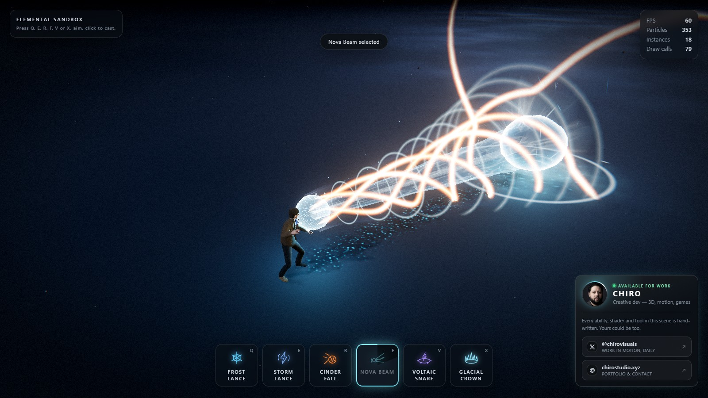

七种技能，两种瞄准方式。四种是**线性施法**：按键装填，地面上出现一条 League-of-Legends 风格的箭头随鼠标摆动，点击施放。另外三种是**远施法**：箭头被一个刻意加粗边界的圆环取代，跟随光标移动，在你点击之前回答范围技能唯一要回答的问题——这一下要覆盖多大的地方。

<p>
  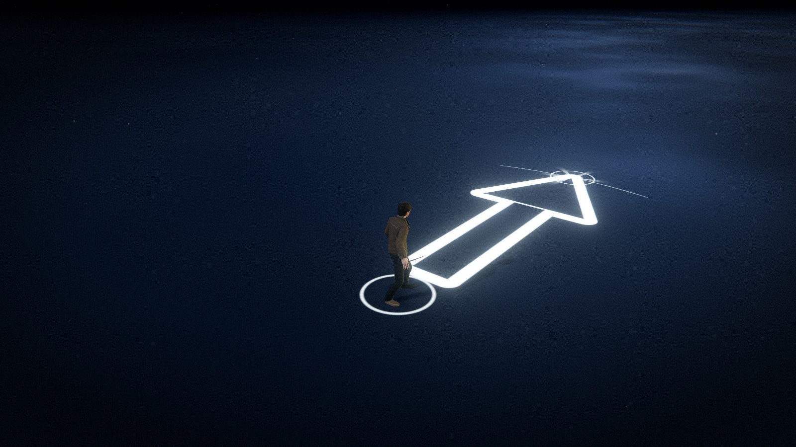
  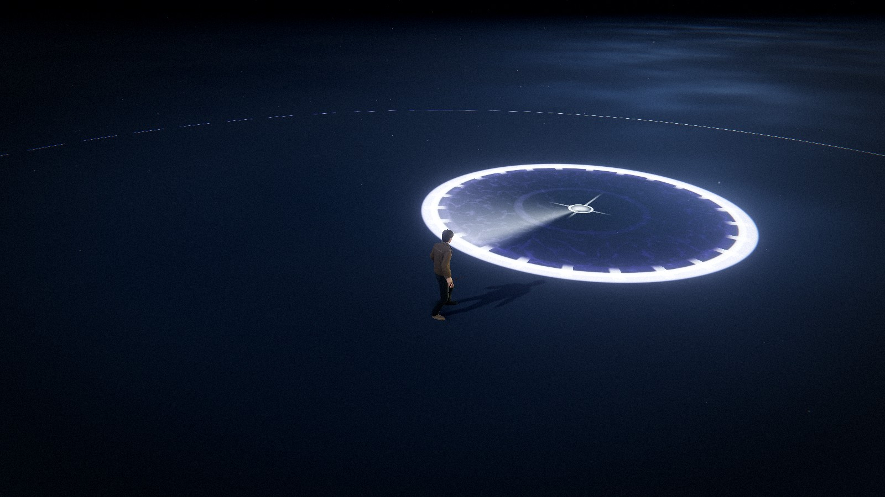
</p>

**Q — 寒霜长枪。** 一道破裂锋沿施法线狂奔，身后一整片冰晶从地面撕开——施法者脚下又小又密，到远端张开成一堵刀锋之墙，落点周围再掀起一簇晶簇。

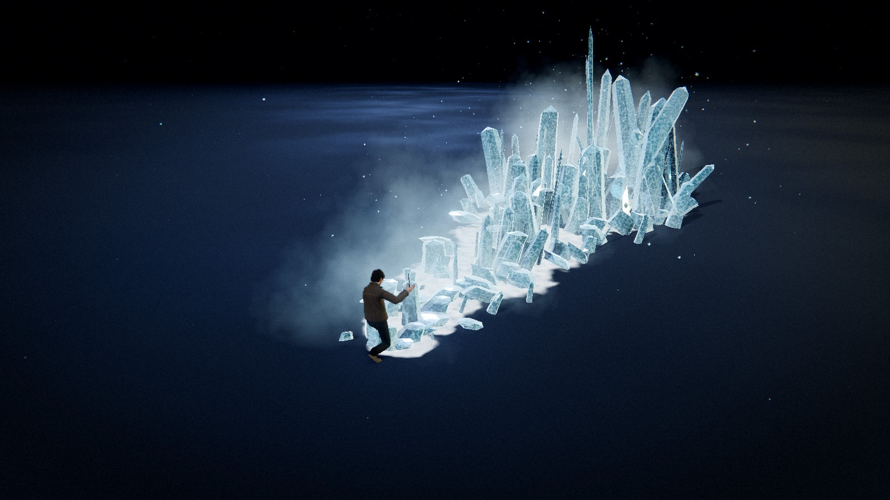

**E — 风暴长枪。** 一道闪电离开施法者的手，一束雷丝在打击锋面之后被拉出，在明灭与再打击之间悬停片刻，然后爆散。沿途不断溅出火花，地面留下枝状电灼与焦痕，远端套上一层电离空气的壳。

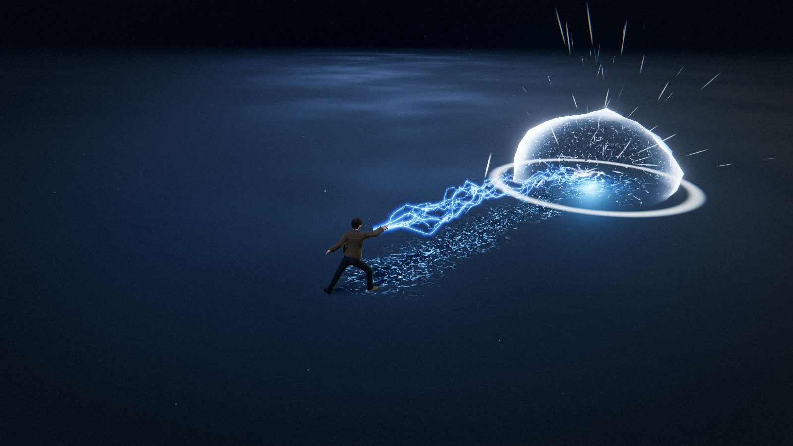

**R — 灰烬坠落。** 一颗燃烧的陨石沿弧线被掷向远方，拖着一条光线步进的燃烧尾迹，一路升温：表面裂开的熔岩缝隙在坠落中越撑越宽、越烧越亮。落地即引爆，把碎裂的岩块抛洒一地，地面被撕成一张持续发光的熔岩裂纹网，直到弹坑烧尽。

<p>
  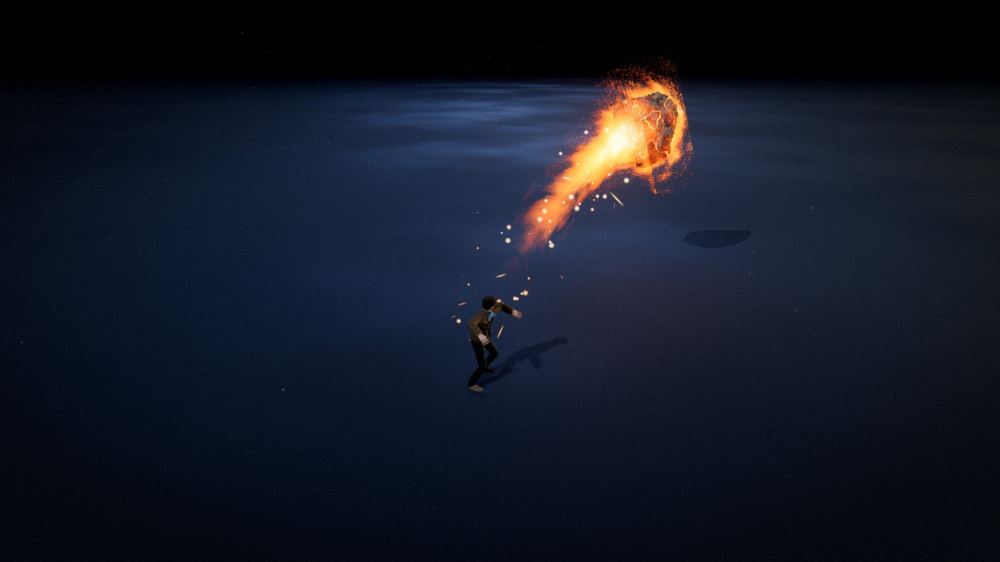
  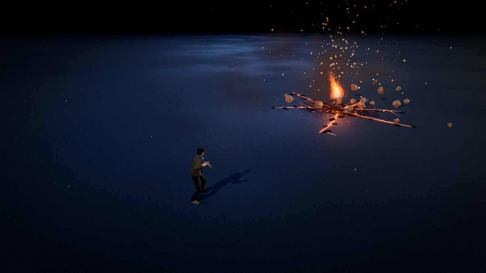
</p>

**F — 新星光束。** 施法者双手搓出一团光球，把空气中的光尘吸进来，然后沿直线放出——白热的芯、青色的鞘、绕着它盘旋的金色缎带和沿束疾驰的冲击盘。它**停在原地**持续烧灼地面、把火花喷回束流，最后收束成一根线熄灭。整个沙盒里唯一一种落地一秒之后还在发生事情的施法。

<p>
  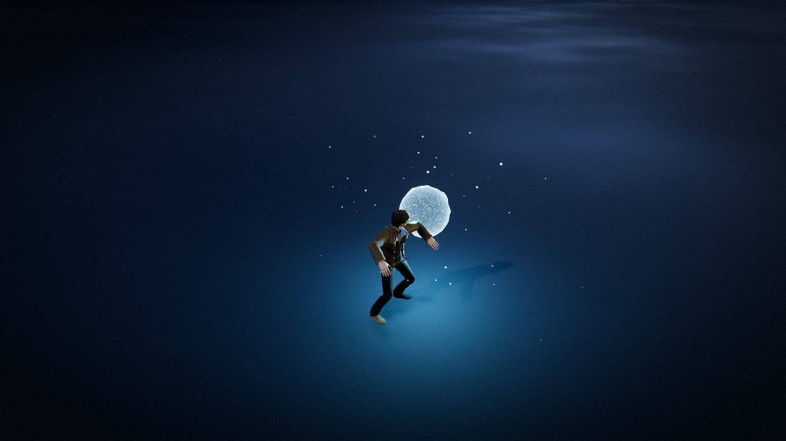
  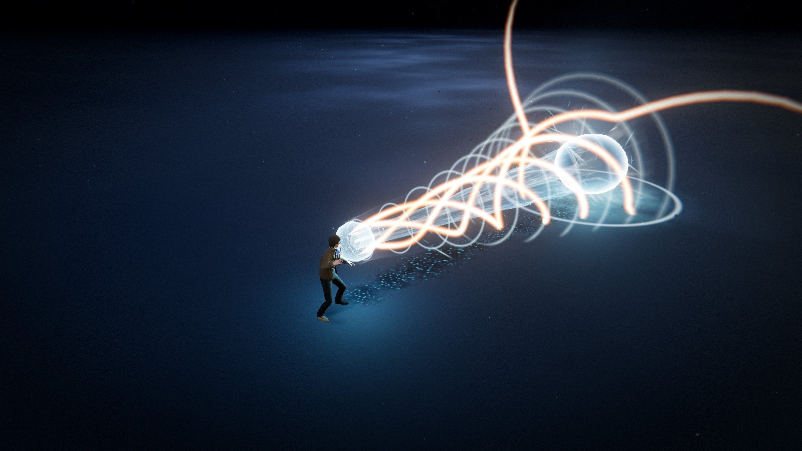
</p>

**V — 雷电陷阱。** 第一种远施法。一条电流长鞭抽向地面，落点处的圆环先撑过自己的半径再收回：一根紫色的电柱从中央撕开，触须向外爬到边界，电弧沿着圆周奔跑，整片地面燃烧。它悬在那里反复再打击、把空气拖进柱心，最后收束成一缕。你点击前量出的那个圆，就是最后燃烧的那个圆。

<p>
  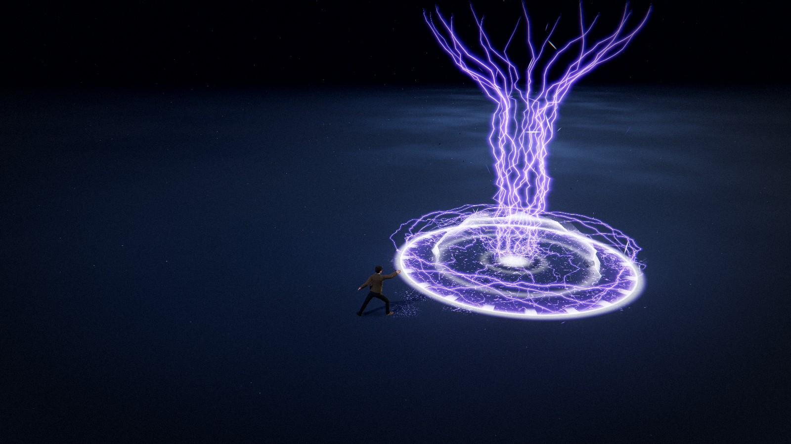
  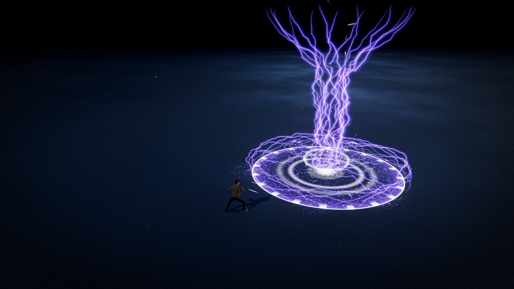
</p>

**X — 冰晶王冠。** 第二种远施法，与雷电陷阱对同一个圆的相反回答。一道寒锋沿地面冲向落点，圆盘冻结到边界，一环冰晶刀锋绕着它从地面撕出——离施法者最近的一片先起，波动沿两侧跑到背后合拢，脚下堆起一圈碎冰。中央保持敞开：读感是一堵你正望进去的墙。它立在那里闪烁、从边缘散出寒气，然后逐片碎裂、沉回地面。

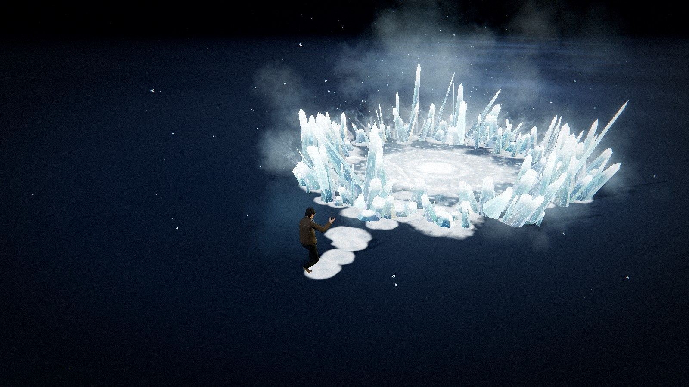

**B — 钞票风暴。** 第三种远施法。在瞄准点撕开一个 ¥100 纸币的旋风：钞票充满整个落点范围，打旋、翻飞、缓缓爬升；风暴松手的那一刻，它们向外螺旋散开，像落叶一样飘落满地。

你能看到的一切都是生成的。除角色外，磁盘上没有任何贴图、精灵图或模型文件：冰晶是程序化几何，闪电是整条由顶点着色器摆放的 ribbon 条带，陨石是在 CPU 上被碎裂面切割出坑洞的二十面球，光束是同一条参数化圆管按三个半径各画一次，陷阱的整座牢笼是同一条 ribbon 条带沿四条参数化路径穿线，箭头、瞄准圆、白霜、灼痕与熔岩裂纹全是有符号距离场与噪声着色器，雾、火花、碎屑与闪光全是 GPU 粒子。

**每个参数都是实时滑条** —— 共 1229 个 —— 并且在模拟暂停时依然实时生效。这正是这个项目的意义所在：用 **P** 把画面冻结在喷发、打击或燃烧的半途，然后对着一张静止的画面重塑轮廓、配色与节奏。

外观参考：`icecast.jpg`、`thundercast.jpg`、`superbeam.jpg` 与 `electricalboost.jpg`。

---

## 小兵系统

场地不是空的。**M**（或技能栏旁的开关）打开后，一个波次导演会让小怪不断从角色四周的地面钻出并向你围拢：

- **波次** — 每隔约 2.6 秒从 19 米外的圆环上钻出一小波（默认 3 只），同屏上限 24 只；彼此之间有分离力，围成一圈而不是叠成一坨。
- **血条** — 每只小兵头顶一条 billboard 血条，整场只有 **1 次**实例化 draw call。满血时隐藏，受击后显示约 2.2 秒，带一段白色的"受伤拖尾"。
- **伤害** — 七种技能全部对小兵有效：线性技能沿"上一帧波前 → 本帧波前"的扫掠段判定（高速弹不会穿透），远施法在落点爆发并持续 tick，光束站立期按 DPS 灼烧。伤害带偏轴衰减与暴击。
- **受击与死亡** — 受击时白闪、被击退、短暂踉跄；生命耗尽后沿受击方向倒下、停留片刻、沉回地面并散出烟尘，随后回池复用，长会话零 GC。
- **调参** — 编辑器里的「👺 小兵」文件夹可以实时调整波次、速度、生命值、伤害倍率、死亡节奏与血条样式——包括暂停（**P**）时。

每种技能的伤害数值（`hitDamage` / `hitWidth` / `tickDamage` 等）写在它自己的 settings 块里，`damageTaken` 是全局难度旋钮。HUD 右上角实时显示场上小兵数与击杀数。

---

## 快速开始

```bash
npm install
```

```bash
npm run dev
```

然后打开 Vite 打印的地址（默认 <http://127.0.0.1:5173>）。

```bash
npm run build
```

```bash
npm run preview
```

### 资产

以下二进制资产由 `public/` 提供，启动时自动加载：

| 文件 | 用途 |
| --- | --- |
| `public/models/Idle.fbx` | 带骨骼的角色 **及其** 待机动画 |
| `public/models/diffuse.png` | 角色的颜色贴图 |
| `public/models/cast1.fbx` | 施法动画 |
| `public/models/cast2.fbx` | 施法动画 |
| `public/models/cast3.fbx` | 施法动画 —— 寒霜长枪、雷电陷阱与冰晶王冠的默认动作 |
| `public/hdri/spruit_sunrise.hdr` | HDR 探针，用于图像光照与冰晶反射 |
| `public/banknotes/cn-100-*.png` | 钞票风暴的正反面扫描图 |

四个 FBX 都是同一套 Mixamo 骨骼的导出，各自带一张蒙皮网格和一条动画栈。角色来自待机文件；施法文件只为其中的动画剪辑而加载，`AnimationClip` 一被取出，随附的重复骨架立即释放。剪辑按骨骼名绑定到骨架上——这正是别的文件里创作的动画能在这里不经重定向直接播放的原因。

这套骨架不自带材质，所以 `diffuse.png` 与它一起加载，在导入材质转 PBR 时作为颜色贴图挂上——如果某个 FBX 自带嵌入贴图，则保留它自己的，因为那张图是按它自己的 UV 创作的。

每种技能选择自己施放的动作 —— settings 块里的 `castAnim`，编辑器对应文件夹「施法」下的下拉框。出厂状态下第 1、5、6 槽——寒霜长枪、雷电陷阱与冰晶王冠——扔 `cast3`，其余扔 `cast1`。剪辑是一次性动作，叠在循环的待机之上，`character.castBlendIn` / `castBlendOut` 是这段叠化的两条边。

HDR 只作为图像光照与冰面反射源加载——它从不作为可见的天空显示。舞台保持平坦的深色背景。

---

## 操作

| 输入 | 动作 |
| --- | --- |
| **Q**（或 **1**） | 装填寒霜长枪 —— 再按一次收回 |
| **E**（或 **2**） | 装填风暴长枪 —— 再按一次收回 |
| **R**（或 **3**） | 装填灰烬坠落 —— 再按一次收回 |
| **F**（或 **4**） | 装填新星光束 —— 再按一次收回 |
| **V**（或 **5**） | 装填雷电陷阱 —— 远施法，圆形指示 |
| **X**（或 **6**） | 装填冰晶王冠 —— 远施法，圆形指示 |
| **B**（或 **7**） | 装填钞票风暴 —— 远施法，圆形指示 |
| **移动鼠标** | 摆动瞄准箭头，或移动远施法圆环 |
| **左键点击** | 沿箭头施放，或在原地放下圆环 |
| **Esc** / **右键** | 取消已装填的施法 |
| **右键拖动** | 环绕镜头 |
| **滚轮** | 缩放 |
| **G** | 显示/隐藏特效编辑器 |
| **P** | 暂停/继续 —— *编辑器修改依然实时生效* |
| **C** | 清除所有生效中的特效 |
| **M** | 显示/隐藏小兵 |
| **H** | 隐藏操作面板 |

`range` 与 `minRange` 按技能各管各的，指示器的射程随当前槽位变化。瞄得比当前技能的 `minRange` 更近时指示器变红并拒绝施放；想在脚边施放就把 `minRange` 设为 0——雷电陷阱出厂就是这个设置，一个不能丢在自己脚下的陷阱等于废了一半。冷却也按技能各算各的，用一个槽位永远不会锁死另一个。

---

## 项目结构

```
src/
  abilities/      Ability 基类（行进的波前）、七种技能、池化管理器
  animation/      FBX 角色加载、AnimationMixer、各技能的施法剪辑、程序化前冲
  assets/         程序化冰晶与陨石几何、闪电 ribbon 条带、光束圆管与冲击盘
  config/         settings.js —— 所有参数的唯一数据源
  core/           App、Renderer、CameraRig、Time、Layers、共享帧 uniform
  effects/        瞄准箭头、远施法圆环、地面贴花、裂纹、爆壳、灯光池、震屏、闪光
  input/          InputManager（事件）与 AimController（两种瞄准形态）
  loaders/        共享 LoadingManager 的 AssetLoader
  materials/      IceMaterial、LightningMaterial、MeteorMaterial、
                  VolumetricFireMaterial、BeamMaterial、SnareMaterial 等
  minions/        小兵本体、波次管理器、实例化血条
  particles/      GPU 粒子系统 + 引擎与速率发射器
  postprocessing/ 合成管线、调色着色器、折射扭曲着色器
  shaders/lib/    共享 GLSL：噪声库、公共工具
  ui/             HUD、lil-gui 编辑器、预设管理、样式
  utils/          数学、颜色缓存、对象池、释放、着色器补丁
  world/          环境（舞台灯光）、地面、尘埃、接触阴影
  archive/        已退役的四元素沙盒 —— 见 archive/README.md
```

---

## 它是如何组织起来的

### settings 就是 API

`src/config/settings.js` 持有所有可调的值，没有别的任何地方拥有这份状态：着色器、粒子系统、灯光和后期 pass **每帧读取**这些对象。这就是编辑器无需重建就能工作的原因——拖动一个滑条，同时改变已经立着的冰场、下一次施法、整个环境和后期栈。预设加载是向同一批对象里深合并，所以所有实时绑定始终有效。

```js
import { settings } from './config/settings.js';
settings.ice.height = 7;          // 下一帧可见，施法途中也生效
settings.thunder.jitter = 1.2;    // 给一条已经在空中的闪电重新打结
settings.global.timeScale = 0.1;  // 把整个施放慢放到爬行
```

技能块以各自在 `ELEMENTS` 里的 id 为键，所有需要知道"玩家当前拿的是哪个技能"的共享系统——瞄准控制器、冷却、HUD——都按 `settings[element]` 查。它们依赖存在的四个字段是 `range`、`minRange`、`speed` 和 `cooldown`；远施法多一个 `zoneRadius`。块里的其余一切都是该技能自己的事。

### 让"暂停时编辑"成立的那条规则

`IceAbility` 里的一根冰刺记录**只存骰子决定的东西**：沿线的位置*分数*、带符号的横向*分数*，以及几个无单位抖动量。施法开始时不捕获任何米、弧度或秒。每个维度都在更新循环里对照 `settings.ice` 解析——包括零长度帧（暂停帧）。

所以拖 `height` 会让已经立着的冰场重新长高；拖 `lean` 会让它重新倾斜；拖 `clumping` 会让它重新向中线聚拢。记录真正捕获的只有时间戳——它自己喷发被触发的时刻。那些是事件，不是尺寸。

四个*形状*参数（`facets`、`taper`、`roughness`、`bend`）无法表达成逐实例变换，只能烘焙进几何体——而六棱冰晶只有 60 个三角形，整个重建比在顶点着色器里逼近更便宜。`IceAbility#_syncGeometry` 对这四个值做哈希，哈希变化时重建三块冰晶网格——这让它们保持为实时滑条，而不是需要重启的常量。

### 瞄准

`AimController` **每帧**把指针射线投到地面——不是只在鼠标移动时——所以装填状态下环绕镜头，指示器会在静止的光标下摆动。它把距离钳进 `[minRange, range]`，跟踪一条 0..1 的展开包络，然后发出一个携带起点、单位方向和距离的 `cast` 事件——恰好就是 `Ability#spawn` 的签名。关于施法做什么，它一个字都不决定。

它跑在**真实时间**上而不是缩放后的模拟增量上，所以沙盒暂停时指示器仍在动画。

有两套指示器、一个控制器。画哪一个由 `ELEMENT_META[element].cast`——`CastShape.LINE` 或 `CastShape.ZONE`——决定，这也是两种形态唯一分歧的地方。装填、钳制、校验、展开与击发全部共享，最终都汇成同一个三参数的 `cast` 事件，因为从瞄准这一侧看，远施法就是一条你只关心远端的线。这就是为什么区域瞄准不需要改动 `Ability`、`AbilityManager` 或 `App`：`SnareAbility` 把落点读作 `pointAt(1)`，然后从那里向外展开。

### 远施法圆环

`ZoneIndicator` 是箭头的反面，由同样两个想法构成：米，和无贴图。

**落点盘**是一块四边形，片元着色器把 UV 重映射成距目标的米数，所以无论圆是 2 米还是 8 米宽，边界始终是 0.34 米厚。这条带刻意做成画面里最重的笔触——它就是全部信息——并且用 `boundaryBias` 让它偏离标称半径劈开，而不是居中，这样它的**外沿**对效果的真实边界保持诚实。内部有偏向边缘的洗色、向外走的等高环、扭曲的细丝，和一个沿施法方向拉长臂的准星——四边形带着施法者的偏航角，那条长臂因此就是朝向。

施法者脚下的**射程环**是闪电的 ribbon 条带弯成的圆：输入 `(t, side)`，输出世界坐标。一块装得下 20 米射程的四边形会有 40 米宽，为一条细线在屏幕上着色一大片被丢弃的片元。

装填时圆环**先撑过半径再收回**，陷阱落地时做同样的事。线性长大的圆读起来是 UI 元素；带回弹的圆读起来是施法者的动作。

### 箭头就是一个 SDF

`AimIndicator` 是一整块地面四边形。片元着色器把 UV 重映射成**距施法者的米数**，所以 `settings.aim` 里的每个参数都是真实尺寸——施法距离是 3 米还是 15 米，箭杆始终 0.42 米宽。

轮廓是一个圆角盒（箭杆）与 iq 的精确三角形 SDF（箭头）的圆角并集；廉价的半平面求交在这种浅楔形上会留下可见的角部瑕疵。从这一个距离场出发，着色器派生出描边、偏向边缘的内部洗色、雪佛龙（被 `|x|` 偏移相位的条纹，把平直条带变成指向施法方向的箭头簇）、寒霜噪声与 voronoi 晶盘、施法者脚下的圆环、射程端帽弧、钉在落点的六重霜花，以及装填时的扫出动画。

### 冰

`materials/IceMaterial.js` 是**打补丁**的 `MeshStandardMaterial` 而不是替换，所以冰晶投射并接收舞台的真实阴影，也能吃到 HDR 探针。风格化叠加在它上面：

- **厚度染色** —— 正对视线的一个面穿过晶体的路径最长，向 `colorDeep` 变暗；掠射边缘保持浅色。正是这一项让整片冰场读作能**看进去**的固体，而不是蓝色塑料。
- **内部裂隙** —— 以**世界**空间采样的脊状噪声，所以裂纹平面无论冰刺是齐踝高还是三米高都保持固定的物理尺寸，相邻的晶体看起来采自同一块料。
- **羽霜与白霜** —— 在**局部**空间（沿晶体 0..1）采样的 fbm，所以乳白的脉络和从底部向上爬的霜线跟随每根冰刺自己的轴，无论它被缩放或倾斜成什么样。
- **闪光** —— 世界空间滚动的高频硬阈值场，偏向掠射角——真实冰面反光的地方。
- **出生闪光** —— 一个逐实例属性，由能力在 `birthFade` 时间内从 1 驱动到 0，让晶体在喷发的瞬间从内部被点亮。

三个 `InstancedMesh` 共享一份材质。用三份而不是一份，是因为**棱面数**不同而不只是比例不同——仅靠逐实例缩放买不到那种轮廓多样性，而三个 draw call 是便宜的代价。

### 闪电

`ThunderAbility` 把"CPU 上没有尺寸"的规则执行得比冰更彻底：根本没有路径对象。闪电是一个 `InstancedBufferGeometry`——参数空间里一排扁平的四边形梯子，每个顶点只带 `(t, side)`：沿闪电走了多远、在 ribbon 的哪条边上。一个实例就是一根雷丝。`materials/LightningMaterial.js` 每帧把这一对数变成世界坐标，所以同一条条带服务任何长度、任何形状、任何宽度的闪电。

形状由三层堆出来：

- **轴线** —— 从手到落点的直线，被 `sag` 压弯。唯一知道施法指向哪的部分。
- **扇形** —— 垂直于轴的平面上的逐丝恒定偏移，从手处的 `spreadNear` 开到落点的 `spread`，并绕轴按 `twist` 滚动。这是把一根雷丝和下一根区分开的东西。
- **打结** —— *线性*插值的值噪声倍频。线性是刻意的：smoothstep 会把角磨圆，而角正是它读作闪电而不是一根扭动的管子的全部原因。

ribbon 通过局部切线与视线向量叉乘转向相机，所以闪电从任何角度看都保持视觉粗细，从不是一条屏幕空间的线。它画两遍——下面一层宽而柔和的光晕，上面一层炽热的芯——因为把辉光画成真实的 ribbon 而不是丢给 bloom，正是它**焊在**每个拐点上不掉的原因。

两个时钟驱动闪烁。`restrike` 每秒 N 次把每根雷丝打到一个新形状，`crawl` 在两次之间连续滑动打结点；两者合起来才让一条悬停的闪电不像一条静态 ribbon。一次施法只捕获一个数字——种子，让两次施法不画出同一条闪电——然后每帧对照 `settings.thunder` 解析所有米、弧度和秒。这就是为什么拖 `jitter` 会给一条已经在空中的闪电重新打结。

地面电灼值得记一笔，作为**反例**。最早的版本在 `atan(y, x)` 上采样雷丝场，这让同一方位角上的所有半径拿到同一个值，从中心画出笔直的辐条——那是一朵烟花，不是灼痕。改为在平面上采样同一噪声并扭曲查找坐标，雷丝才能蜿蜒分叉。

### 光束

新星光束共享闪电的规则——CPU 上没有尺寸——却用它抵达了相反的观感。闪电的全部魅力在于噪声*分段线性*、保留棱角；光束里的每个噪声项都是光滑的、沿流动强烈拉伸、向下游爬行。会打结的光束就是闪电。

它是真实的圆管而不是面向相机的 ribbon，因为这么粗的一根柱子必须有**横截面**：环绕它时轮廓必须正确鼓起，远壁要透过近壁叠加，冲击盘要贴着它。`createBeamTubeGeometry` 是 ribbon 条带多一个维度的版本——每个顶点带 `(t, a)`，沿炮身多远、绕一圈多远——`materials/BeamMaterial.js` 每帧把这一对变成世界坐标。

同一根圆管画三次，玄机在三次的权重：

- **halo** —— 最宽，只有一项边缘项。光束推开的那层大气。
- **sheath** —— 偏向边缘加权，所以它读作**空心**，轮廓边缘是它最亮的部分。
- **core** —— 细，权重**相反**：视线沿炮身穿行、在管内路径最长的地方最亮。

外层偏边、内层偏轴、双面叠加——这就是一次廉价体积积分，而正是这个反向让中间读作一根实心光柱而不是一根被点亮的管子。调宽 `coreWidth` 或推高 `coreFill`，三层就塌成一根白管——青色的鞘和金色的线圈之所以还能分清，是因为芯给它们留了位置。

再加两个实例化 pass 提供结构。**线圈**是闪电的 ribbon 条带弯成的螺旋，面向相机、刻意偏暖——颜色的分离是它们不溶解进鞘里的原因。**冲击盘**是一个实例化圆环，相位是 `fract(index / count + time × speed)`，所以整列盘是时钟的纯函数，CPU 上没有队列。两者都贴着圆管用的同一个 `beamRadius()` 摆放，所以拖动轮廓时五者始终焊在一起。

光束还是唯一有**第四拍**的技能。其他三种跑 travel → impact → fade；它在前面加了蓄力，而基类为此什么都没改：`advance()` 在光球蓄满之前干脆不让波前离开手心，于是 `IMPACT` 变成燃烧，相位机原封不动。所以远端有一个持续发生的落点——沿束喷回的火花、从燃烧点剥落的压力壳、推过地面的尘环与冲击环，全部经过与粒子相同的分数速率发射器节流，所以每个速率都是实时滑条。

### 陷阱

雷电陷阱是第一个围绕*点*而非*线*构建的技能，把它粘在一起的是：`zoneRadius` 在每个消费方有且只有一处读取，没有任何地方复制它——指示器量出它、触须在它上面收尾、边缘电弧沿它奔跑、地面燃烧它、柱子的喉口和喇叭口是它的分数。拖动它，五者一起变，施法途中、暂停时钟下都行。

整座牢笼——种陷阱的鞭子、柱子、触须和边缘电弧——是**一条实例化 ribbon 条带**，就是闪电和光束线圈画的那条。一根雷丝的*角色*由顶点着色器拿它的实例索引对照四个实时计数决定，角色决定它被穿进哪条参数化路径：

- **leash** —— 从手到行进梢头的下垂线，落在地面上。
- **column** —— 螺旋攀升，半径从 `throat` 开到 `columnSpread`。
- **tendril** —— 向外游走的蜿蜒，偏移量是逐丝常量而不是噪声，所以它弯曲的方式像一次认准了方向的放电。
- **rim** —— 沿边界行进的弧，中段从边界上方跃过。

每个偏移随后活在一个由路径差分得到的标架里——这让同一个打结函数既服务竖直的柱子、也服务贴地爬行的细丝。两个贴地角色的偏移垂直分量被阻尼并钳在地面上方——一个自由 `y` 的结会把每根触须埋掉一半，效果读作断裂的虚线。把某个计数设为零会整个退役那个角色——这就是圆环接管的那一帧鞭子消失的方式。无论空中有多少根丝，两个 draw call 覆盖全部四个角色。

**地面场**是一块四边形而不是池化贴花，原因只有一个：贴花在生成那一刻就固定了半径，而这个圆必须在站立期间随 `zoneRadius` 重新缩放。它的脉络在平面上采样并做了域扭曲——闪电地面灼痕教过的那一课，同样的原因。

下一个远施法最值得偷的东西是 **snap**：圆环在 `Easing.outCubic` 上展开，乘以一个晚峰值、恰好在 1 处归零的凸包，所以它先撑过半径再收回来，柱子以慢 1.7× 的同一时钟攀升。地面先到，空气随后在它上面崩开。

### 小兵

小兵系统由三个文件组成，全部沿用能力系统的既有约定：池化、只存骰子与时间戳、每帧对照 settings 采样。

- **`Minion.js`** —— 单个小兵。状态机 `RISE → SEEK → CROWD → DYING` 与能力的相位机同构。身体是球和圆锥合并成的单个几何体，正面朝 +Z，两颗自发光眼睛共享一份材质；每只小兵克隆一份身体材质做受击白闪。移动是三行 steering：朝目标收拢、邻居推开、到 `attackRange` 停下围拢。死亡沿受击方向绕脚倒下、停留、沉回地面——不透明的地面负责遮挡，不需要透明度，也就没有排序问题。
- **`MinionManager.js`** —— 波次导演、对象池，以及技能调用的两个动词：`damageSegment(from, to, width, damage, { hitSet })`（沿线的带状判定）和 `damageCircle(center, radius, damage, { hitSet })`（范围判定）。可选的 `hitSet` 是调用方拥有的 Map，键是小兵、值是它的出生 token——池化的小兵转世不会被误当成已命中的那具身体。省略 `hitSet` 则是持续伤害，下一帧可以再打。
- **`HealthBars.js`** —— 所有血条合成**一个实例化网格**。每实例 CPU 只写四个数：头顶锚点、当前血量比例、拖尾比例、显示透明度；billboard 在顶点着色器里从 view 矩阵展开，血条本体是米制空间里的圆角矩形 SDF。

伤害在技能侧的落点刻意做得很薄：`Ability` 基类在 TRAVEL 相机里用 `hitWidth`/`hitDamage`（各技能自己的配置）调用一次扫掠判定，范围技能在 `onImpact`/`onFade` 里各加三行，光束在站立期按 `burnDamage × dt` 烧它的地面投影。

### 再加一种技能

1. 在 `config/settings.js` 加一个 settings 块，并在 `ELEMENTS` / `ELEMENT_META` 里加一项。
2. 继承 `Ability`，实现 `createShaders`、`createParticles`、`onTravel`、`onImpact`、`onFade`。
3. 在 `abilities/AbilityManager.js` 里注册类。
4. 在 `ui/Editor.js` 加编辑器文件夹，在 `ui/glyphs.js` 加印记。
5. 在 `input/InputManager.js` 绑定按键——它发出带 0 基槽位的 `ability` 事件，由 `App` 通过 `ELEMENTS` 映射。

想让它成为**远施法**而不是线性施法，只加两样东西：`ELEMENT_META` 条目里的 `cast: CastShape.ZONE`，和 settings 块里的 `zoneRadius`。圆形指示器、射程环、回弹展开和整套瞄准循环白送，能力把落点读作 `pointAt(1)`。

其余的一切——池化、行进的波前、局部标架、灯光、相位、按技能冷却、瞄准射程与镜头取景——要么继承、要么由 `ELEMENTS` 驱动。HUD 用这个数组搭槽位，新技能自己出现在技能栏里。想让它对小兵有伤害，再在配置块里写上 `hitWidth` / `hitDamage`（线性）或在钩子里调 `damageCircle`（范围）即可。

### 粒子

`particles/ParticleSystem.js` 是 GPU 模拟的实例化四边形系统。运动（速度、重力、解析阻力、curl 湍流、涡旋）、尺寸随生命、颜色梯度和透明度衰减全部在着色器里由逐实例属性求值；CPU 只写生成数据，而且只上传变化过的槽位。粒子住在环形缓冲区里，所以连发技能是复用槽位而不是分配。剪影（柔和、烟、条纹、叶、碎屑、圆环）是程序化的——整个项目没有任何精灵贴图。

寒霜长枪用三个系统：**雾**（非叠加，让雾真正遮挡、给冰场深度）、**冰屑**（重力下受光的碎屑）和**闪光**（叠加、负重力——参考帧里那道标志性的上升光羽）。

风暴长枪用四个：**火花**（重力下速度拉伸的条纹）、**尘点**（闪电周围缓慢的电离漂移）、**烟**（焦地面上的非叠加薄雾）和**碎屑**（受光碎屑）。它的火花每帧从闪电沿途的多个点发出而不是一个：光束沿着全身脱落，单一原点会让每一批读成星爆。

新星光束同样用四个，其中一个用了两次：它的**尘点**在蓄力时螺旋*吸入*光球、点火后又从柱身向外漂——同一份辉光，换个方向扔。它的**火花**从炮身径向抛出再被 `sparkForward` 拖向下游——那是"压力"的读感；闪电则是下坠，就凭这一处差别把两个技能分开了不少。

小兵补充了一个：**消散烟尘**——死亡与钻出地面时喷出的加色粒子，全群共享一个环形缓冲。

### 渲染管线

每帧：

1. **深度预通道** —— 不透明的世界写入半分辨率的打包深度缓冲。每个 VFX 着色器采样它做软相交，所以没有任何东西在地面切出硬线。冰晶在 `LAYER.WORLD` 上，雾和闪光对着它们柔和淡出。
2. **扭曲通道** —— 扭曲层上的网格把屏幕空间 UV 偏移写进第二个半分辨率缓冲。当前构建没有任何东西写它；保留这个 pass 是因为它是折射效果将来要用的挂钩。
3. **合成器** —— 场景 → 折射扭曲 → bloom → 色调映射（ACES）→ 调色。

调色 pass 把色差、lift/gain/对比/饱和/色温、暗角、胶片颗粒和落点闪光折叠进一次重采样。

阴影来自一盏方向光，它的正交阴影相机每帧对角色重新居中，在 4096² 下装进 52 米的盒（约 1.3 厘米/纹素）。先试过 `three/addons` 的 CSM 模块后又移除了：它*全局*替换 three 的 `lights_fragment_begin` chunk，任何没有显式注册进它的材质会无声地失去全部方向光。

接触阴影是一次真实的渲染：角色的深度从下方写进 256² 目标，模糊两次后投到地面。

---

## 编辑器与预设

按 **G** 打开面板。文件夹：预设、全局、瞄准指示器、远距施放圆环、寒霜长枪、风暴长枪、灰烬坠落、新星光束、雷电陷阱、冰晶王冠、钞票风暴、小兵、环境、后期处理、镜头、角色。每个文件夹默认收起——这里的控件多到任何一个展开都会把其余的顶出屏幕。

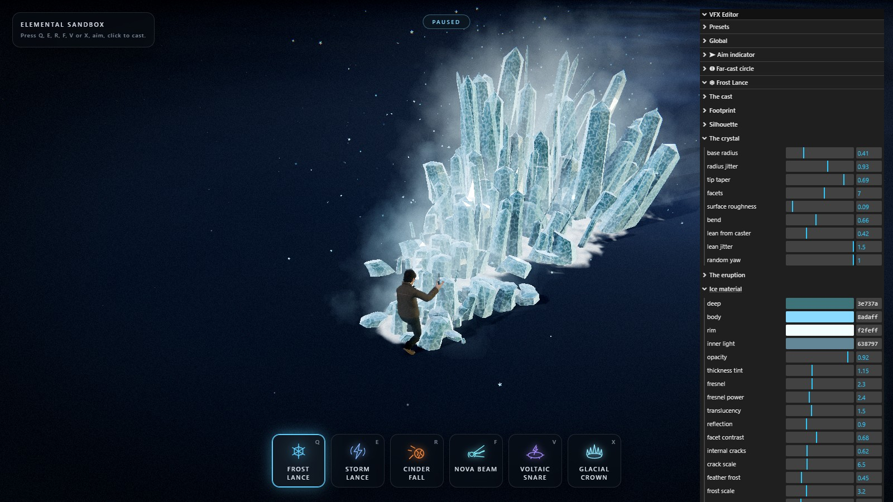

- **全局**倍率一次缩放一切（速度、辉光、噪声、粒子、灯光、落点强度、镜头震动、时间缩放……）。
- **瞄准指示器** —— 箭头的米制轮廓、描边与填充、雪佛龙与寒霜，以及圆环与霜花。
- **远距施放圆环** —— 边界带、内部、刻度、扫掠与准星、射程环，以及回弹。所有远施法共享，所以归档在瞄准这一侧而不是任何单个技能下面。
- **寒霜长枪** —— 施法、覆盖范围、轮廓、冰晶本体、喷发节奏、冰材质、地面霜雪、雾/冰屑/闪光、落点与动态光。
- **风暴长枪** —— 施法、闪电离手的位置、雷束、单根雷丝、ribbon、闪烁与再打击、闪电配色、地面灼痕、火花/尘点/烟/碎屑、枪口与落点，以及动态光。
- **新星光束** —— 施法、离手位置、光柱、芯/鞘/halo 叠层、表面与流动、配色、线圈、冲击盘、蓄力与吸入、地面的反应、火花/尘点/蒸汽/碎屑、释放/落点/燃烧，以及两盏动态光。
- **雷电陷阱** —— 施法与落点、鞭子、柱子、触须、边缘电弧、共享的雷丝形状与闪烁、ribbon 与配色、地面场、灼痕、火花/上升流/烟/碎屑、投掷/展开/悬停，以及动态光。
- **钞票风暴** —— 施法与落点、旋风、纸币的翻飞与旋转、尺寸与辉光，以及动态光。
- **小兵** —— 波次（同屏上限、每波数量、间隔、刷新半径）、行动（速度、围拢距离、间距、颠簸与摇摆）、生存与伤害（生命、受伤倍率、暴击、击退、踉跄）、死亡（倒下/停留/沉没时长、消散粒子）、外观（体型、配色、眼睛）与血条（宽度、悬空高度、显示时长、配色）。
- **预设** 保存在 `localStorage`，可以复制、删除、导出 JSON、导入 JSON，或恢复出厂默认。

每种技能把它画到的**每一种**颜色都暴露出来，且没有一种是从另一种派生的：冰晶配色、闪电配色、光束的四层与其线圈和盘、地面印记、落点壳、冲击环、屏幕闪光，以及每个粒子系统一条四站点的生命周期渐变（`初生 → 前段 → 后段 → 消亡`）。不动冰而给雾调色、闪电保持蓝色而把火花调凉到橙色，都只差一次取色。

预设就是 settings 树的普通快照，所以导出的文件人手可读可改。

几个值得认识的旋钮，因为它们对各自技能的重塑最大：

- `ice.heightCurve` —— 坡爬得多晚；调高后冰场一直贴地，到落点才炸开。`ice.frontBias` 低于 1 时冰晶向落点聚拢。
- `thunder.jitter` 与 `thunder.jitterScale` —— 闪电打结多狠、多频。`thunder.strands` 与 `thunder.spread` 决定雷束的宽度读感，`thunder.restrike` 决定频闪强度。这五个撑起这个效果的性格。
- `beam.radius` 与 `beam.flare` —— 光柱读起来多重、落点处张得多开。`beam.charge` 与 `beam.lifetime` 是蓄力与悬停——正是它们让这个技能手感不同于其他三个——`beam.coreWidth` / `beam.coreFill` 决定各层保持可分还是炸成一片白。
- `snare.zoneRadius` —— 整个远施法建立在其上的那一个数字。它把瞄准圆、触须、边缘电弧、灼烧场和柱子的喉口一起实时缩放。之后 `snare.snapTime` 与 `snare.height` 撑起展开的那一刻，`snare.tendrils` / `snare.rimArcs` / `snare.strands` 决定这片落点实际被点亮多少。
- `zone.boundary` 与 `zone.snap` —— 远施法圆环的边缘读起来多厚、出场回弹多硬。两者合起来决定指示器读作 UI 覆盖层、还是施法者正在做的事。
- `minions.health` / `minions.damageTaken` —— 小兵的生存能力与全局难度；配合各技能块的 `hitDamage` / `tickDamage`，一套击杀节奏全在这里调。

---

## 性能笔记

- 技能、贴花、爆壳和粒子全部按类型池化。连放十二次同一个技能最多只构建**四个**能力实例，然后就不再分配。
- 整片冰晶场无论多少根都是三个 draw call；上限 288 根。
- 整条闪电**两个** draw call，无论多少根雷丝；上限 24 根、每根 72 个采样。路径完全不碰 CPU，所以 `strands` 几乎免费。
- 整座陷阱——鞭子、柱子、触须、边缘电弧——**两个** draw call 加地面场一个，无论里面有多少根丝；四种角色合计上限 56。与闪电一样，形状完全不碰 CPU，调高 `tendrils` 或 `rimArcs` 几乎免费。它的瞄准圆再加两个：一块四边形加一条环带。
- 整条光束是**六个** draw call，无论身上有多少线圈和盘——一个共享几何的三次圆管 pass，加线圈、盘、蓄力球各一次实例化绘制。与闪电一样，形状不碰 CPU，`coils` 与 `rings` 几乎免费。它占掉六盏动态灯里的两盏（光柱与施法者双手），所以四条并发光束会耗尽灯光池；`LightPool.acquire()` 返回 null，每个使用处都有兜底。
- 六盏动态点光在启动时创建、停在零强度，而不是动态增删——改变灯的数量会强迫 three 重编译所有材质。
- 小兵是池化的实体：满配 24 只约 48 次 draw call（身体与发光眼睛各一次，几何已合并）加血条 **1 次**实例化绘制，外加一份全群共享的消散烟尘系统；死亡回池，零 GC。小兵材质纳入加载期的着色器预热，第一只小兵出现不会卡顿。
- 阴影贴图每帧只更新一次，即使场景被渲染多次。
- `renderer.compileAsync()` 在启动时跑完，所以第一次施法不会在着色器编译上顿挫。
- 像素比上限 1.75；深度与扭曲缓冲都是半分辨率。

默认施法的实测值：空闲 32 draw calls，冰场立满约 69，闪电在空中约 49，活跃粒子约 1150。陷阱带着牢笼、地面场与边缘灼痕立满约 45 draw calls、约 480 活跃粒子，装填它的瞄准圆再加两个。四个并发施法——池子上限，不论来自哪些槽位——峰值约 186 draw calls、六盏动态灯用了五盏。满屏 24 只小兵再加约 49 次。

实时计数器（FPS、活跃粒子、实例、draw calls、小兵、击杀）在 HUD 右上角。

---

## 归档

`src/archive/` 是这个项目的上一世：一个四元素御术沙盒（火、水、土、气），沿手绘的样条施放，还有一个让化身沿着同一笔触行走的行走模式。其中的任何东西都不会被线上应用导入，Vite 不会打包它。

它被退役是因为这一版用手绘路径换成了线性技能，拆掉了那些系统赖以构建的输入。其中的光线步进火焰和水面尤其值得挖掘。见 `src/archive/README.md` 了解里面有什么、以及如何恢复某一块。

---

## 已知的粗糙边缘

- 冰晶以 `transparent: true`、`depthWrite: true` 绘制。对接近不透明的冰这是正确的取舍，也让冰场不会对自己排序出错；但 `ice.opacity` 调低后，重叠冰刺之间的排序瑕疵会显形。
- 喷发锋是平地上的一条直线。两个假设都焊死了——地面是 y = 0 的一块平面，瞄准射线也只打这个平面。小兵系统同样建立在这个假设上（血条锚点与伤害判定都在 XZ 平面）。
- 扭曲通道空转。每帧花一次半分辨率 clear。
- 落点晶簇沿端点径向摆放，施法距离很短时会比应有的更严重地压到身后的带子。
- 远施法把平地假设继承了两遍：圆画在 y = 0 的一块四边形上，陷阱的触须与边缘电弧也贴着同一平面摆放。它们都不会贴着台阶垂下来。
- 瞄准圆与陷阱的地面场都是加色的，所以落点亮化地面而不是给它着色。换浅色地面的话，边界下面需要一层非叠加的 pass 才能保持可读。

---

## 许可

代码按本项目所需"按现状"提供。捆绑的 HDR 探针与角色 FBX 保留其原始许可。
